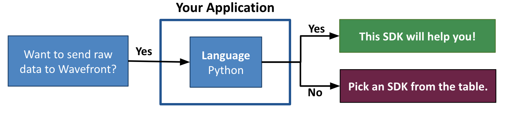
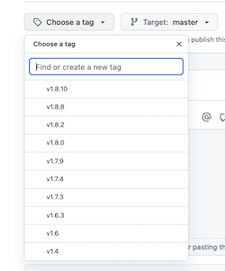

# wavefront-sdk-python

[](https://github.com/wavefrontHQ/wavefront-sdk-python/actions)
[](https://pypi.org/project/wavefront-sdk-python/)
[](https://pypi.org/project/wavefront-sdk-python/)
[](https://pypi.org/project/wavefront-sdk-python/)


## Table of Content
* [Prerequisites](#Prerequisites)
* [Set Up a Sender](#set-up-a-sender)
* [Send a Single Data Point](#send-a-single-data-point)
* [Send Batch Data](#send-batch-data)
* [Get the Failure Count](#get-the-failure-count)
* [Close the Connection](#close-the-connection)
* [License](#License)
* [How to Get Support and Contribute](#how-to-get-support-and-contribute)
* [How to Release](#how-to-release)

# VMware Aria Operations™ for Applications Python SDK

VMware Aria Operations for Applications (formerly known as Wavefront) Python SDK lets you send raw data from your Python application to Operations for Applications using a wavefront_sender interface. The data is then stored as metrics, histograms, and trace data. This SDK is also referred to as the Wavefront Sender SDK for Python.

Although this library is mostly used by the other Operations for Applications Python SDKs to send data to Operations for Applications, you can also use this SDK directly. For example, you can send data directly from a data store or CSV file to Operations for Applications.

Note: We're in the process of updating the product name to Operations for Applications, but in many places we still refer to it as Wavefront.

**Before you start implementing, let us make sure you are using the correct SDK!**



> ***Note***:
> </br>
>   * **This is the VMware Aria Operations for Applications SDK for Python (Sender SDK for Python)!**
>   If this SDK is not what you were looking for, see the [table](#wavefront-sdks) below.

#### VMware Aria Operations for Applications SDKs
<table id="SDKlevels" style="width: 100%">
<tr>
  <th width="10%">SDK Type</th>
  <th width="45%">SDK Description</th>
  <th width="45%">Supported Languages</th>
</tr>

<tr>
  <td><a href="https://docs.wavefront.com/wavefront_sdks.html#sdks-for-collecting-metrics-and-histograms">Metrics SDK</a></td>
  <td align="justify">Implements a standard metrics library. Lets you define, collect, and report custom business metrics and histograms from any part of your application code.   </td>
  <td>
    <ul>
    <li>
    <b>Java</b>: <a href ="https://github.com/wavefrontHQ/wavefront-dropwizard-metrics-sdk-java">Dropwizard</a> <b>|</b> <a href ="https://github.com/wavefrontHQ/wavefront-runtime-sdk-jvm">JVM</a>
    </li>
    <li>
    <b>Python</b>: <a href ="https://github.com/wavefrontHQ/wavefront-pyformance">Pyformance SDK</a>
    </li>
    <li>
      <b>Go</b>: <a href ="https://github.com/wavefrontHQ/go-metrics-wavefront">Go Metrics SDK</a>
      </li>
    <li>
    <b>.Net/C#</b>: <a href ="https://github.com/wavefrontHQ/wavefront-appmetrics-sdk-csharp">App Metrics SDK</a>
    </li>
    </ul>
  </td>
</tr>

<tr>
  <td><a href="https://docs.wavefront.com/wavefront_sdks.html#sdks-for-sending-raw-data-to-wavefront">Sender SDK</a></td>
  <td align="justify">Lets you send raw data for storage as metrics, histograms, or traces, e.g., to import CSV data into the service.
  </td>
  <td>
    <ul>
    <li>
    <b>Java</b>: <a href ="https://github.com/wavefrontHQ/wavefront-sdk-java">Sender SDK</a>
    </li>
    <li>
    <b>Python</b>: <a href ="https://github.com/wavefrontHQ/wavefront-sdk-python">Sender SDK</a>
    </li>
    <li>
    <b>Go</b>: <a href ="https://github.com/wavefrontHQ/wavefront-sdk-go">Sender SDK</a>
    </li>
    <li>
    <b>.Net/C#</b>: <a href ="https://github.com/wavefrontHQ/wavefront-sdk-csharp">Sender SDK</a>
    </li>
    <li>
    <b>C++</b>: <a href ="https://github.com/wavefrontHQ/wavefront-sdk-cpp">Sender SDK</a>
    </li>
    </ul>
  </td>
</tr>

</tbody>
</table>

## Prerequisites

* Python versions 3.7 - 3.11 are supported.
* Install `wavefront-sdk-python`
    ```
    pip install wavefront-sdk-python
    ```

## Set Up a Sender

You can send metrics, histograms, or trace data from your application to the service using a Wavefront Proxy or direct ingestions.

* Use [**direct ingestion**](https://docs.wavefront.com/direct_ingestion.html) to send the data directly to the service. This is the simplest way to get up and running quickly.
* Use a [**Wavefront Proxy**](https://docs.wavefront.com/proxies.html), which then forwards the data to the service. This is the recommended choice for a large-scale deployment that needs resilience to internet outages, control over data queuing and filtering, and more.

You instantiate an object that corresponds to your choice:
* Option 1 **(Deprecated)**: [Create a `WavefrontDirectClient`](#option-1-create-a-wavefrontdirectclient) to send data directly to a Wavefront service.
* Option 2 **(Deprecated)**: [Create a `WavefrontProxyClient`](#option-2-create-a-wavefrontproxyclient) to send data to a Wavefront Proxy.
* Option 3: [Create a `WavefrontClient`](#option-3-create-a-wavefrontclient) to send data to the service directly or via proxy.
> **Deprecated implementations**: *`WavefrontDirectClient` and `WavefrontProxyClient` are deprecated from proxy version 7.0 onwards. We recommend all new applications to use the `WavefrontClient`.*

### Option 1: Create a WavefrontDirectClient
When sending data via direct ingestion, you need to create a `WavefrontDirectClient`, and build it with the cluster URL and API token to send data directly to the service.

>**Prerequisites**
> * Verify that you have the Direct Data Ingestion permission. For details, see [Examine Groups, Roles, and Permissions](https://docs.wavefront.com/users_account_managing.html#examine-groups-roles-and-permissions).
> * The URL of your cluster. This is the URL you connect to when you log in to the service, typically something like `https://<domain>.wavefront.com`.
> * [Obtain the API token](http://docs.wavefront.com/wavefront_api.html#generating-an-api-token).

#### Initialize the WavefrontDirectClient
You initialize a `WavefrontDirectClient` by providing the access information you obtained in the Prerequisites section..

Optionally, you can specify parameters to tune the following ingestion properties:

* Max queue size - Internal buffer capacity of the sender. Any data in excess of this size is dropped.
* Flush interval - Interval for flushing data from the sender directly to the service.
* Batch size - Amount of data to send to the service in each flush interval.

Together, the batch size and flush interval control the maximum theoretical throughput of the sender. You should override the defaults _only_ to set higher values.


```python
from wavefront_sdk import WavefrontDirectClient

# Create a sender with:
   # your cluster URL
   # an API token that was created with direct ingestion permission
   # max queue size (in data points). Default: 50,000
   # batch size (in data points). Default: 10,000
   # flush interval  (in seconds). Default: 1 second
wavefront_sender = WavefrontDirectClient(
    server="<SERVER_ADDR>",
    token="<TOKEN>",
    max_queue_size=50000,
    batch_size=10000,
    flush_interval_seconds=5
)
```

### Option 2: Create a WavefrontProxyClient

>**Prerequisite** <br/>
>Before your application can use a `WavefrontProxyClient`, you must [set up and start a Wavefront proxy](https://docs.wavefront.com/proxies_installing.html).

When sending data via the Wavefront Proxy, you need to create a `WavefrontProxyClient`. Include the following information.

* The name of the host that will run the Wavefront Proxy.
* One or more proxy listening ports to send data to. The ports you specify depend on the kinds of data you want to send (metrics, histograms, and/or trace data). You must specify at least one listener port.
* Optional settings for tuning communication with the proxy.

> **Note**: See [Advanced Proxy Configuration and Installation](https://docs.wavefront.com/proxies_configuring.html) for details.

```python
from wavefront_sdk import WavefrontProxyClient

# Create a sender with:
   # the proxy hostname or address
   # the default listener port (2878) for sending metrics to
   # the recommended listener port (2878) for sending histograms to
   # the recommended listener port (30000) for sending trace data.
   # if you are directly using the sender sdk to send spans without using any other sdk, use the same port as the customTracingListenerPorts configured in the wavefront proxy for the tracing_port
wavefront_sender = WavefrontProxyClient(
   host="<PROXY_HOST>",
   metrics_port=2878,
   distribution_port=2878,
   tracing_port=30000,
   event_port=2878
)
```

> **Note:** When you set up a Wavefront Proxy on the specified proxy host, you specify the port it will listen to for each type of data to be sent. The `WavefrontProxyClient` must send data to the same ports that the Wavefront Proxy listens to. Consequently, the port-related parameters must specify the same port numbers as the corresponding proxy configuration properties:

| `WavefrontProxyClient()` parameter | Corresponding property in `wavefront.conf` |
| ----- | -------- |
| `metrics_port` | `pushListenerPorts=` |
| `distribution_port` | `histogramDistListenerPorts=` |
| `tracing_port` | `traceListenerPorts=` |

### Option 3: Create a WavefrontClient
Use `WavefrontClientFactory` to create a `WavefrontClient` instance, which can send data directly to the service or send data using a Wavefront Proxy.

The `WavefrontClientFactory` supports multiple client bindings. If more than one client configuration is specified, you can create a `WavefrontMultiClient` instance, which can send data to multiple services.
### Prerequisites
* Sending data via Wavefront Proxy?
  <br/>Before your application can use a `WavefrontClient` you must [set up and start a Wavefront Proxy](https://docs.wavefront.com/proxies_installing.html).
* Sending data via direct ingestion?
  * Verify that you have the Direct Data Ingestion permission. For details, see [Examine Groups, Roles, and Permissions](https://docs.wavefront.com/users_account_managing.html#examine-groups-roles-and-permissions).
  * The HTTP URL of your cluster. This is the URL you connect to when you log in to the service, typically something like `http://<domain>.wavefront.com`.<br/> You can also use HTTP client with Wavefront Proxy version 7.0 or newer. Example: `http://proxy.acme.corp:2878`.
  * [Obtain the API token](http://docs.wavefront.com/wavefront_api.html#generating-an-api-token).

### Initialize the WavefrontClient
```python
from wavefront_sdk.client_factory import WavefrontClientFactory

# Create a sender with:
   # Required Parameter
   #   URL format to send data via proxy: "proxy://<your.proxy.load.balancer.com>:<somePort>"
   #   URL format to send data via direct ingestion: "https://TOKEN@DOMAIN.wavefront.com"
   # Optional Parameter
   #   max queue size (in data points). Default: 50000
   #   batch size (in data points). Default: 10000
   #   flush interval  (in seconds). Default: 1 second

client_factory = WavefrontClientFactory()
client_factory.add_client(
    url="<URL for proxy or direct ingestions>",
    max_queue_size=50000,
    batch_size=10000,
    flush_interval_seconds=5)
wavefront_sender = client_factory.get_client()
```
#### Add multiple clients to client factory to send data to multiple services.
```
from wavefront_sdk.client_factory import WavefrontClientFactory

client_factory = WavefrontClientFactory()
client_factory.add_client("proxy://our.proxy.lb.com:2878")
client_factory.add_client("https://someToken@DOMAIN.wavefront.com")

# Send traces and spans to the tracing port. If you are directly using the sender SDK to send spans without using any other SDK, use the same port as the customTracingListenerPorts configured in the wavefront proxy. Assume you have installed and started the proxy on <proxy_hostname>.
client_factory.add_client("http://<proxy_hostname>:30000")

wavefront_sender = client_factory.get_client()
```

## Send a Single Data Point

The following examples show how to send a single data point to the service. You use the Wavefront Sender you created above.

### Single Metric or  Delta Counter

```python
from uuid import UUID

# Wavefront metrics data format:
# <metricName> <metricValue> [<timestamp>] source=<source> [pointTags]
wavefront_sender.send_metric(
    name="new_york.power.usage",
    value=42422.0,
    timestamp=1533529977,
    source="localhost",
    tags={"datacenter": "dc1"})

# Wavefront delta counter data format:
# <metricName> <metricValue> source=<source> [pointTags]
wavefront_sender.send_delta_counter(
    name="delta.counter",
    value=1.0,
    source="localhost",
    tags={"datacenter": "dc1"})
```
***Note***: If your metric name has a bad character, that character is replaced with a `-`.

### Single Histogram Distribution

```python
from uuid import UUID
from wavefront_sdk.entities.histogram import histogram_granularity

# Wavefront histogram data format:
# {!M | !H | !D} [<timestamp>] #<count> <mean> [centroids] <histogramName> source=<source> [pointTags]
# Example: You can choose to send to at most 3 bins: Minute, Hour, Day
# "!M 1533529977 #20 30.0 #10 5.1 request.latency source=appServer1 region=us-west"
# "!H 1533529977 #20 30.0 #10 5.1 request.latency source=appServer1 region=us-west"
# "!D 1533529977 #20 30.0 #10 5.1 request.latency source=appServer1 region=us-west"
wavefront_sender.send_distribution(
    name="request.latency",
    centroids=[(30, 20), (5.1, 10)],
    histogram_granularities={histogram_granularity.DAY,
                             histogram_granularity.HOUR,
                             histogram_granularity.MINUTE},
    timestamp=1533529977,
    source="appServer1",
    tags={"region": "us-west"})
```

### Single Span

If you are directly using the Sender SDK to send data to the service, you won’t see span-level RED metrics by default unless you use the Wavefront Proxy and define a custom tracing port (`tracing_port`). See [Instrument Your Application with the Sender SDKs](https://docs.wavefront.com/tracing_instrumenting_frameworks.html#instrument-your-application-with-wavefront-sender-sdks) for details.

```python
from uuid import UUID

# Wavefront trace and span data format:
# <tracingSpanName> source=<source> [pointTags] <start_millis> <duration_milliseconds>
# Example: "getAllUsers source=localhost
#           traceId=7b3bf470-9456-11e8-9eb6-529269fb1459
#           spanId=0313bafe-9457-11e8-9eb6-529269fb1459
#           parent=2f64e538-9457-11e8-9eb6-529269fb1459
#           application=Wavefront http.method=GET
#           1533529977 343500"
wavefront_sender.send_span(
    name="getAllUsers",
    start_millis=1533529977,
    duration_millis=343500,
    source="localhost",
    trace_id=UUID("7b3bf470-9456-11e8-9eb6-529269fb1459"),
    span_id=UUID("0313bafe-9457-11e8-9eb6-529269fb1459"),
    parents=[UUID("2f64e538-9457-11e8-9eb6-529269fb1459")],
    follows_from=None,
    tags=[("application", "Wavefront"),
          ("service", "istio"),
          ("http.method", "GET")],
    span_logs=None)
```

### Single Event

```python
# Wavefront event format:
# @Event <StartTime> <EndTime> "<EventName>"  severity="<Severity>"
# type="<Type>" details="<EventDetail>" host="<Source>" tag="<Tags>"
wavefront_sender.send_event('event name',
                            1592200048,
                            1592201048,
                            "localhost",
                            ["env:", "dev"],
                            {"severity": "info",
                             "type": "backup",
                             "details": "broker backup"})
```

## Send Batch Data

The following examples show how to generate data points manually and send them as a batch to Wavefront.

### Batch Metrics

```python
from uuid import UUID
from wavefront_sdk.common import metric_to_line_data

# Generate string data in Wavefront metric format
one_metric_data = metric_to_line_data(
    name="new-york.power.usage",
    value=42422,
    timestamp=1493773500,
    source="localhost",
    tags={"datacenter": "dc1"},
    default_source="defaultSource")

# Result of one_metric_data:
  # '"new-york.power.usage" 42422.0 1493773500 source="localhost" "datacenter"="dc1"\n'

# List of data
batch_metric_data = [one_metric_data, one_metric_data]

# Send list of data immediately
wavefront_sender.send_metric_now(batch_metric_data)
```
***Note***: If your metric name has a bad character, that character is replaced with a `-`.

### Batch Histograms

```python
from uuid import UUID
from wavefront_sdk.entities.histogram import histogram_granularity
from wavefront_sdk.common import histogram_to_line_data

# Generate string data in Wavefront histogram format
one_histogram_data = histogram_to_line_data(
    name="request.latency",
    centroids=[(30.0, 20), (5.1, 10)],
    histogram_granularities={histogram_granularity.MINUTE,
                             histogram_granularity.HOUR,
                             histogram_granularity.DAY},
    timestamp=1493773500,
    source="appServer1",
    tags={"region": "us-west"},
    default_source ="defaultSource")

# Result of one_histogram_data:
  # '!D 1493773500 #20 30.0 #10 5.1 "request.latency" source="appServer1" "region"="us-west"\n
  # !H 1493773500 #20 30.0 #10 5.1 "request.latency" source="appServer1" "region"="us-west"\n
  # !M 1493773500 #20 30.0 #10 5.1 "request.latency" source="appServer1" "region"="us-west"\n'

# List of data
batch_histogram_data = [one_histogram_data, one_histogram_data]

# Send list of data immediately
wavefront_sender.send_distribution_now(batch_histogram_data)
```
### Batch Trace Data

If you are directly using the Sender SDK to send data to the service, you won’t see span-level RED metrics by default unless you use the Wavefront Proxy and define a custom tracing port (`tracing_port`). See [Instrument Your Application with Wavefront Sender SDKs](https://docs.wavefront.com/tracing_instrumenting_frameworks.html#instrument-your-application-with-wavefront-sender-sdks) for details.

```python
from uuid import UUID
from wavefront_sdk.common import tracing_span_to_line_data

# Generate string data in Wavefront tracing span format
one_tracing_span_data = tracing_span_to_line_data(
    name="getAllUsers",
    start_millis=1552949776000,
    duration_millis=343,
    source="localhost",
    trace_id=UUID("7b3bf470-9456-11e8-9eb6-529269fb1459"),
    span_id=UUID("0313bafe-9457-11e8-9eb6-529269fb1459"),
    parents=[UUID("2f64e538-9457-11e8-9eb6-529269fb1459")],
    follows_from=[UUID("5f64e538-9457-11e8-9eb6-529269fb1459")],
    tags=[("application", "Wavefront"), ("http.method", "GET")],
    span_logs=None,
    default_source="defaultSource")

# Result of one_tracing_span_data:
  # '"getAllUsers" source="localhost" traceId=7b3bf470-9456-11e8-9eb6-529269fb1459 spanId=0313bafe-
  # 9457-11e8-9eb6-529269fb1459 parent=2f64e538-9457-11e8-9eb6-529269fb1459 followsFrom=5f64e538-
  # 9457-11e8-9eb6-529269fb1459 "application"="Wavefront" "http.method"="GET" 1552949776000 343\n'

# List of data
batch_span_data = [one_tracing_span_data, one_tracing_span_data]

# Send list of data immediately
wavefront_sender.send_span_now(batch_span_data)
```

### Batch Events

```python
from wavefront_sdk.common import event_to_line_data

# Generate string data in Wavefront event format
one_event_data = event_to_line_data(
    name="event name",
    start_time=1592200048,
    end_time=1592201048,
    source="localhost",
    tags=["env", "dev"],
    annotations={"severity": "info",
                 "type": "backup",
                 "details": "broker backup"})

# Result of one_event_data:
# '@Event 1592200048 1592201048 "event name" severity="info" type="backup" details="broker backup"
# host="localhost" tag="env" tag="dev"\n'

# List of events
batch_event_data = [one_event_data, one_event_data]

# Send list of events immediately
wavefront_sender.send_event_now(batch_event_data)
```

## Get the Failure Count

If the application failed to send metrics, histograms, or trace data via the `wavefront_sender`, you can get the total failure count.

```python
# Get the total failure count
total_failures = wavefront_sender.get_failure_count()
```
## Close the Connection

* If the sender is from a `WavefrontClientFactory`, close the connection before shutting down the application.

    ```python
    # To shut down a sender from a WavefrontClientFactory
    wavefront_sender = client_factory.get_client()

    # Close the sender connection
    wavefront_sender.close()
    ```
* If the sender is a `WavefrontDirectClient`, flush all buffers and then close the connection before shutting down the application.

    ```python
    # To shut down a WavefrontDirectClient
    # Flush all buffers.
    wavefront_sender.flush_now()

    # Close the sender connection
    wavefront_sender.close()
    ```
* If the sender is a `WavefrontProxyClient`, close the connection before shutting down the application.

    ```python
    # To shut down a WavefrontProxyClient

    # Close the sender connection
    wavefront_sender.close()
    ```

## License
[Apache 2.0 License](LICENSE).

## How to Get Support and Contribute

* When submitting changes, be sure to increment the version number in setup.py.
  The version number is documented as such in setup.py.
  We follow semantic versioning. For bug fixes, increment the patch version
  (last number). For backward compatible changes to the API, update the
  minor version (second number), and zero out the patch version. For breaking
  changes to the API, increment the major version (first number) and zero out
  the minor and patch versions.
* Reach out to us on our public [Slack channel](https://www.wavefront.com/join-public-slack).
* If you run into any issues, let us know by creating a GitHub issue.

## How to Release

1. Merge all the changes that need to go into the release to the master branch.
2. Open the `setup.py` file from the top level directory of the project.
3. Search for version= in the file to find the version number, for example 1.8.15.
4. Create a pull request, get it reviewed and approved, and merge it after approval.
5. Check [test.pypi.org](https://test.pypi.org/project/wavefront-sdk-python) for a published package, make sure it's production ready.
6. Log in to GitHub, click Releases on the right, and click Draft a new release.
7. For **Choose a tag**, choose the version you found in step 3, and prefix it with `v` for example `v1.8.15`. You need to enter the version where it says **Find or create new tag**.



8. Provide a short but descriptive title for the release.
9. Fill in the details of the release. Please copy the markdown from the previous release and follow the same format.
10. Click **Publish release.** to start publishing the release to pypi.org.
11. From the GitHub top navigation bar of this project, click the **Actions** tab. On the first line of the list of workflows, you should see a workflow running that will publish your release to pypi.org.
12. When the workflow from step 9 has a green checkmark next to it, go to [pypi.org](https://pypi.org/project/wavefront-sdk-python/) and verify that the latest version is published.
